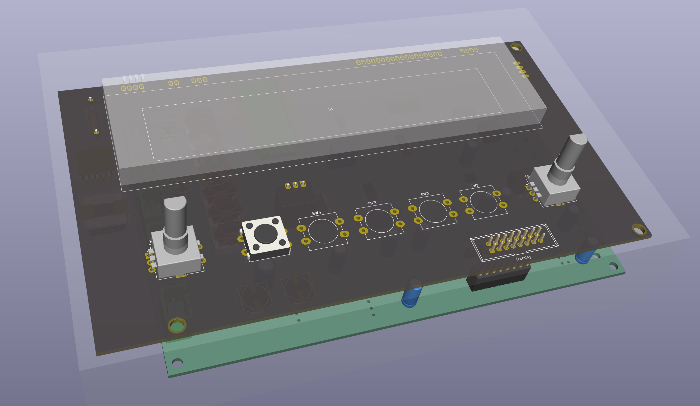

# PCB's

### Reminder

To edit a schematic/pcb, open the .pro file first (double click) KiCad needs this to handle sch/pcb together, otherwise u get wiered errors when updating pcb from schematic.

## GP1294



A Panel with that display and an Teensy4.

Intended Use: Graphical EQ. The bottom PCB is a FreeDSP-AllInOne.
 * Infopage https://freedsp.github.io/
 * Github: https://github.com/freeDSP/freeDSP-ALLinONE 

Contains
* Power for VFD (~3V fillament, 30-50V for anode and grid) and 5V for other stuff.
* Teensy4 - Controls the Amp and shows vintage spectrum analyser.
* 2 Encoders
* 5 Buttons.

### Todo

* Teensy3 ? cheeper / better ?
* Test VFD
* Test Serial Buttons 74165
  * Breadboard not working ! Me too doof. Measure on Shruthi !
* Test audio connection to/from teensy I2S slave ! Can it do USB playback ? T3.2 or T4.0 ?
* Generate DSP C interface files. Test ! (It worked with the FreeDSP controller project)
* FreeDSP-AIO flaws ✅
  * speaker mute before shutdown...
    * it has a startup unmute circuit but no shutdown...
    * [One more7414 gate and 2 diodes and 2 resistors...](https://www.falstad.com/circuit/circuitjs.html?ctz=CQAgjCAMB0l3BWEAmM0EE4DMGAcB2ZLMSANjABYxkQFTbbJaBTAWjDACgA3EV-XBXCkmrQbmFMmEElOgQpUdJwBKfcZPUZ6YEVHAppNavpgJOAB3W6UyIWJvJcErKc5hcr1lgTH89VmRCcH9TdHBoUnosaCxXJEh3Tz4fGm0+ILT6OSQ0KJAYuIZEjy9UkAo4DODKxTMI-ML4qE4Adz4wUJt2ExtE9sC7YQ6u7M4AcxH6XFFO+nSpTgBjKeH2UJn9ZDYJCmgMbREOHAO8SgTYSC4AJ1XWCgl1nWzweDg21bn1aVDE26eQgEvnZFLJ4MtViDVlhIEImNsxBV9rgMP4sKQMHRILhkNglHAuJMATD7F8sMg6h9BkIoQCof1IZUOiZ6VSvl9AsEvgzqWtyn0qfyAuUFpZqjRauKKqQhK5FlYehKqorpbK3ANMiB0pzjE4WhquXrvL5wHqefyjfzflTkENaeVWQMHUzjUrFhT8B16JKmHFvSAALYAVwALsxOB6pRyKRJKEIhABBAMWVgAegAogA5COQT0OZ6iZxMB4VEAANQAlgA7AAU1ECFDLAEoc3nCPCXaQhhwJYGAIYWAA6AGdh0GLBYADYATxHZZHIYA9iOEGWqbhHEN85o-nx2ygXfuSfoZu8iUfYXuKQVr4sBvvaaQ6Af5Xwn-RH8-j3KWqU+AhQlpCh0npJRckiaJYmaHkH2xK8O1fe4QJdYDvSqH8eVtWVL2JS9MLtYJeVZP97nJPgS1dciJByBpIKKBIxRVWkewKS8MMFE17keDkSx5CgyKAsiuP1O5qG40JhMSAATKVJXYDA3RQEApOYAAzPsg0nENOBknUKm1MAFP0j9lLUjStLZEw5MMxSeRsiplXs1CRNIiVtX4mhWQVGUqLfWUaHYgYfOEgFJNbUSjQo3RixAAAFRdWmYa4AHkq3CyiQuPVh0iEAArINhxDEc+xHAALZhJwsJKF2XYdxmYIrh1XdKAI-F1fFjUIhArAMA2YKSKz7MMRwsBLquHKSEqrEcVLDJYQwrRc0sjeS3ICTYEAoeMQGSlQR0XVSRrG65JtaabhwAHyOxLrnHdKeMeTZsv9YdJwS67xvHGaGuYebFrS-53xff9AKZaRwQGZzBM8sH3C7L0HNmb1NhoFT1M0kNWEnfqDAUfFCQRh4keMtx-hsayrKqJgEHeSGyOcvTnJg68WP4QRwBMGD2dZgQhGi398HsfcedIWMjIgGn4HxDAqDeOX4BoFRmGHCtCr7KslnDe9Rc0Nm+b0RJF0MG99AADw3K4aAuPGkCQCRUH0JBWE22gbelJTwdoALqIYQIsE4I2KACmgmHNkgWTkGRSwSAoY4ge4JR-J36dcOVYAYoA) ... voltage divider at the schmitt input set to trigger when Vin goes below 8V or so !? then OR that output via 2 diodes into the spk_sleep. Adjust: turn pot from full (cw) towards 0 (ccw) until the mute LED goes off.
    * tested ✅
  * Not much capacitance at Vin, more caps ! Could delay the shutdown ! More time to mute ! ✅

# Refs

Used Kicad 3d models:
 * models https://gitlab.com/MountyRox/kicad-packages3D.git 
 * sources https://gitlab.com/kicad/libraries/kicad-packages3D-source.git

# Reminders

Start more Kicad instances on MacOS:
```
open -n -a "kicad"
```