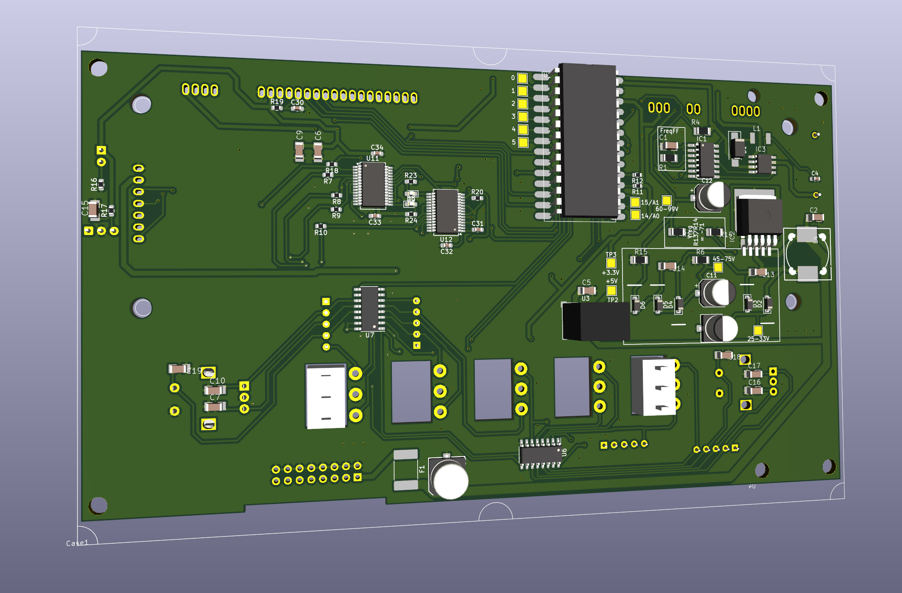
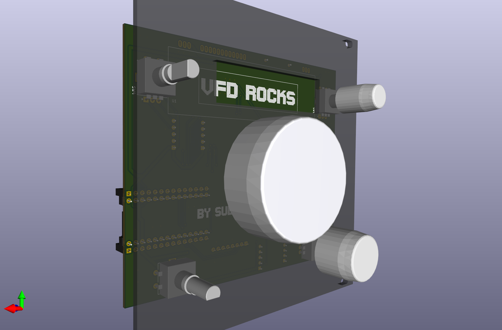

# PCB's

### Reminder

To edit a schematic/pcb, open the .pro file first (double click) KiCad needs this to handle sch/pcb together, otherwise u get wiered errors when updating pcb from schematic.

## GP1294 panel

| front | back |
|---|---|
|  |  |
| | |

A Panel with that display and an Teensy4.

Intended Use: Graphical EQ. The bottom PCB is a FreeDSP-AllInOne.
 * Infopage https://freedsp.github.io/
 * Github: https://github.com/freeDSP/freeDSP-ALLinONE 

Contains
* Power for VFD (~3V fillament, 30-50V for anode and grid) and 5V for other stuff.
* Teensy4 - Controls the Amp and shows vintage spectrum analyser.
* 2 Encoders
* 5 Buttons.

### Status

Tested, has bugs... Can be patched to work somewhat.

### Bugs

* VFD pin 9 (TEST) must have 100k pullup to 3.3V and small buffer C.✅
* SDA/SCL are twisted ! ✅
* PL(atch) is not connected to ATTiny ! Removed ATTiny ✅
* ATTiny fliegt raus, zu umstaendlich.✅
* I2S pins wrong, fixed + SRCs ✅
* 5V reg wrong footprint (from a kicad lib)
* Add revision info
* Crosscheck wiring with proto

### Bugs

* RECOM 5V reg wrong footprint (from a kicad lib)
* VFD pin 9 (TEST) must have 100k pullup to 3.3V and small buffer C.

### Todo

* Test audio connection to/from teensy I2S slave ! Can it do USB playback ? T3.2 or T4.0 ?

* FreeDSP-AIO flaws ✅
  * speaker mute before shutdown...
    * it has a startup unmute circuit but no shutdown...
    * [One more7414 gate and 2 diodes and 2 resistors...](https://www.falstad.com/circuit/circuitjs.html?ctz=CQAgjCAMB0l3BWEAmM0EE4DMGAcB2ZLMSANjABYxkQFTbbJaBTAWjDACgA3EV-XBXCkmrQbmFMmEElOgQpUdJwBKfcZPUZ6YEVHAppNavpgJOAB3W6UyIWJvJcErKc5hcr1lgTH89VmRCcH9TdHBoUnosaCxXJEh3Tz4fGm0+ILT6OSQ0KJAYuIZEjy9UkAo4DODKxTMI-ML4qE4Adz4wUJt2ExtE9sC7YQ6u7M4AcxH6XFFO+nSpTgBjKeH2UJn9ZDYJCmgMbREOHAO8SgTYSC4AJ1XWCgl1nWzweDg21bn1aVDE26eQgEvnZFLJ4MtViDVlhIEImNsxBV9rgMP4sKQMHRILhkNglHAuJMATD7F8sMg6h9BkIoQCof1IZUOiZ6VSvl9AsEvgzqWtyn0qfyAuUFpZqjRauKKqQhK5FlYehKqorpbK3ANMiB0pzjE4WhquXrvL5wHqefyjfzflTkENaeVWQMHUzjUrFhT8B16JKmHFvSAALYAVwALsxOB6pRyKRJKEIhABBAMWVgAegAogA5COQT0OZ6iZxMB4VEAANQAlgA7AAU1ECFDLAEoc3nCPCXaQhhwJYGAIYWAA6AGdh0GLBYADYATxHZZHIYA9iOEGWqbhHEN85o-nx2ygXfuSfoZu8iUfYXuKQVr4sBvvaaQ6Af5Xwn-RH8-j3KWqU+AhQlpCh0npJRckiaJYmaHkH2xK8O1fe4QJdYDvSqH8eVtWVL2JS9MLtYJeVZP97nJPgS1dciJByBpIKKBIxRVWkewKS8MMFE17keDkSx5CgyKAsiuP1O5qG40JhMSAATKVJXYDA3RQEApOYAAzPsg0nENOBknUKm1MAFP0j9lLUjStLZEw5MMxSeRsiplXs1CRNIiVtX4mhWQVGUqLfWUaHYgYfOEgFJNbUSjQo3RixAAAFRdWmYa4AHkq3CyiQuPVh0iEAArINhxDEc+xHAALZhJwsJKF2XYdxmYIrh1XdKAI-F1fFjUIhArAMA2YKSKz7MMRwsBLquHKSEqrEcVLDJYQwrRc0sjeS3ICTYEAoeMQGSlQR0XVSRrG65JtaabhwAHyOxLrnHdKeMeTZsv9YdJwS67xvHGaGuYebFrS-53xff9AKZaRwQGZzBM8sH3C7L0HNmb1NhoFT1M0kNWEnfqDAUfFCQRh4keMtx-hsayrKqJgEHeSGyOcvTnJg68WP4QRwBMGD2dZgQhGi398HsfcedIWMjIgGn4HxDAqDeOX4BoFRmGHCtCr7KslnDe9Rc0Nm+b0RJF0MG99AADw3K4aAuPGkCQCRUH0JBWE22gbelJTwdoALqIYQIsE4I2KACmgmHNkgWTkGRSwSAoY4ge4JR-J36dcOVYAYoA) ... voltage divider at the schmitt input set to trigger when Vin goes below 8V or so !? then OR that output via 2 diodes into the spk_sleep. Adjust: turn pot from full (cw) towards 0 (ccw) until the mute LED goes off.
    * tested ✅
  * Not much capacitance at Vin, more caps ! Could delay the shutdown ! More time to mute ! ✅

## MN12832L panel

| front | back |
|---|---|
|  |  |
| | |

Eurorack 24U format - 12cm width. Made for some very specific recycled receiver knobs.

### Status

Batch v0.1 ordered.

### BOM

| "Id" | "Designator" | "Footprint" | "Quantity" | "Designation" |
| --- | --- | --- | --- | --- |
| 15 | "U3,U4" | "SOIC-16_3.9x9.9mm_P1.27mm" | 2 | "74HC165" |  |  | 
| 34 | "U1" | "MN12832L" | 1 | "~" |  |  | 
| 30 | "U2" | "Teensy4.0" | 1 | "~" |  |  | 
| 23 | "U5" | "Converter_DCDC_RECOM_R-78E-0.5_THT" | 1 | "R-78B5.0-2.0" |  |  | 
| 29 | "IC2" | "SO8" | 1 | "ZXBM5210" |  |  | 
| 17 | "IC1" | "SO14" | 1 | "74132D" |  |  | 
| 18 | "IC3" | "TO263-5" | 1 | "XL6009" |  |  | 
|  2 | "D5,D4,D3,D2" | "D_SOD-123" | 4 | "1N4448W" |  |  | 
| 16 | "D1" | "D_SOD-123" | 1 | "1N5818" |  |  | 
| 14 | "L1" | "L_Cenker_CKCS5020" | 1 | "SM-NE45" |  |  | 
| 22 | "L2" | "L_Cenker_CKCS8040" | 1 | "22uH" |  |  | 
|  1 | "C1" | "C1206" | 1 | "4.7n" (FF-Freq) |  |  | 
| 10 | "C4" | "CP_Elec_6.3x5.8" | 1 | "47u/35v" |  |  | 
| 12 | "C6" | "CP_Elec_6.3x5.8" | 1 | "4.7u/100v" |  |  | 
| 13 | "C3,C5" | "C_1210_3225Metric_Pad1.33x2.70mm" | 2 | "1u/100v" |  |  | 
| 33 | "C2" | "C_0603_1608Metric_Pad1.08x0.95mm" | 1 | "1u" |  |  | 
|  4 | "R2,R1" | "R_0603_1608Metric_Pad0.98x0.95mm" | 2 | "2.7k" (R2-FF-Freq) |  |  | 
|  5 | "RN4,RN3,RN1,RN2" | "R_Array_SIP5" | 4 | "R_Network04" |  |  | 
| 25 | "R14,R13" | "R_0603_1608Metric" | 2 | "2.2k" |  |  | 
| 11 | "R6" | "R_Axial 10mm" | 1 | "91k" |  |  | 
| 24 | "R4" | "R_Axial_DIN0207_L6.3mm_D2.5mm_P10.16mm" | 1 | "91k" VoltReg |  |  | 
| 31 | "R5" | "R_Axial_DIN0207_L6.3mm_D2.5mm_P10.16mm" | 1 | "2k" | |  | 
|  9 | "R3" | "0411_15" | 1 | "22" 5W |  |  | 
| 35 | "SW3,SW2,SW1,SW4,SW5" | "RotaryEncoder_Alps_EC11E" | 5 |  |  |  | 


# Refs

Used Kicad 3d models:
 * models https://gitlab.com/MountyRox/kicad-packages3D.git 
 * sources https://gitlab.com/kicad/libraries/kicad-packages3D-source.git

# Reminders

Start more Kicad instances on MacOS:
```
open -n -a "kicad"
```