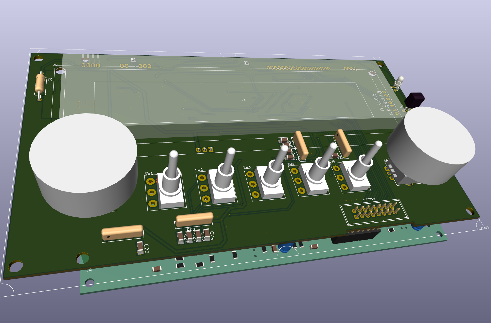

# PCB's

### Reminder

To edit a schematic/pcb, open the .pro file first (double click) KiCad needs this to handle sch/pcb together, otherwise u get wiered errors when updating pcb from schematic.

## GP1294

A Panel with that display and an Teensy4.

Intended Use: Graphical EQ. The bottom PCB is a FreeDSP-AllInOne.
 * Infopage https://freedsp.github.io/
 * Github: https://github.com/freeDSP/freeDSP-ALLinONE 

Contains
* Power for VFD (~3V fillament, 30-50V for anode and grid) and 5V for other stuff.
* Teensy4 - Controls the Amp and shows vintage spectrum analyser.
* 2 Encoders
* 5 Buttons.

### Todo

* Power in/out detection circuit ! To control Amp muting.
* Teensy3 ? cheeper / better ?
* Test audio connection to/from teensy I2S slave ! Can it do USB playback ?
* Generate DSP C interface files. Test ! (It worked with the FreeDSP controller project)
* FreeDSP-AIO flaws
  * speaker mute before shutdown...
    * it hase a startup unmute circuit but no shutdown...
    * mute = ground pin 5 of 7414 would trigger a mute ? Does it work -> test!!!
  * Not much capacitance at Vin, more caps ! Could delay the shutdown ! More time to mute !
* Add 3d Knobs for encoder and buttons
* Classic flip switches instead of se buttons ?

# Refs

Used Kicad 3d models:
 * models https://gitlab.com/MountyRox/kicad-packages3D.git 
 * sources https://gitlab.com/kicad/libraries/kicad-packages3D-source.git
