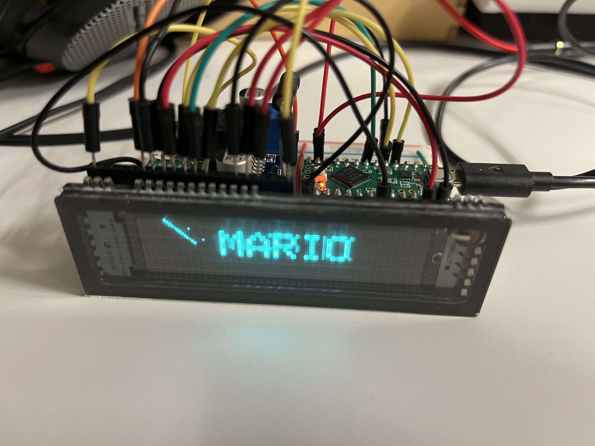
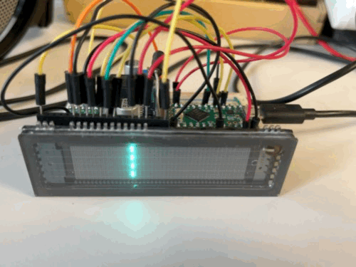
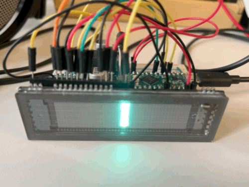

# Status

InProgress... ultra experimental...

| This is brainf***, motivate pls me ! |  |
|---|---|

### Step 3

Ok, sort of does it. Wrote a setPixel func. 

There is bluring between neightbouring gates, because I skip one in between where I would have to change the bitorder of the output from abcdef to defa+b+c+ (+ marks the next 6er block) in fact in memory it would cahnge from afbecd to urg.. dcebfa ? My brain hurts.

Is it simply bitswapped ??? still a pain to do? Maybe with a second draw buffer, then drawing takes double time !? Lookup 

Mapping for odd grid pos...

|    | disp | mem | bin | bin | bin | bin | bin | bin |
|:---:|:---:|:---:|:---:|:---:|:---:|:---:|:---:|:---:|
| this | abcdef | afbecd | 100000 | 010000 | 001000 | 000100 | 000010 | 000001 |
| becomes | defabc | dcebfa | 000001 | 000010 | 000100 | 001000 | 010000 | 100000 |

 * removing one of the parallel shift inputs makes the thing dim a bit, I wonder if that's how greyscales could work. But way does the datasheet says 8 greyscales ???
 * Still found no use for GCP pin.

### Step 2

Ohhh it scans through all gates... changed to SPI MSBFIRST, this makes more sense now. Data is a fixed vertical pixel stripe for starters...

### Step 1

It does something, that's cygling through the 44 gates using the last 6 bytes of the row data. Did not see the pixel data yet

 * It does not activate the last gate
 * Bit order is backwards? Gate 1 should be left.
 * GCP pin ??? no effect seen
 * No data seen yet

 * Shift inputs are in parallel, removing one, leads to flicker / column skipping or so, so maybe it's an internal thing ?

# How does it work ???

### Theory 1 

* Can chain the 2 shift registers to get one with 480 bits, thats 60 bytes

* Bits 1-192 = 24bytes are pixel, 193-236 are gates, so the later just shift..
  * 3 bit per gate - that seems to be the 3 gray values - WRONG thats 3 pixels per gate, almost, first and last are shorter

* 
  * Ah mhm ok so it scans from left to right and you give it 2 coluns of pixels each time ?

* After shifting we pull LAT pin high, normally it stays low

* BLK (blank) should go high when data is transfered ? or just during the latch ?, this turns off the high voltage

* always have 2 neightboring gates on, shift them trough

* MYSTERY 1: Why 2 shift registers
  * Maybe just use them in parallel ???

* MYSTERY 2: GCP = "is the counter clock for the PWM decoder" this seems to turn high 5 times during shifting ??? Haeh ???
  * Mhm it toggles within one gate phase buhaahh then I need to set a time to do that ???
    * So do the latch/blank
    * Start timer to get these 5 impulses out ??? 
    * And why 6 pulses ? 
    * Add 6 pulses during shifting... no timer ?
  * New idea,
    * This just toggles through the 6 pixels.
    * Because there are 2 gates for 6 pixels, only one column can be on during one gate cycle.
    * if not cygled or with inconsistant timing this will should lead to different brightness per column !?
    * Then the 8 grey levels just come from the fastness, you can baller through 3 subframes per frame if needed.

* Mystery 3:
  * Ahh the bits are swapped around afbecd... so mem layout is???  bits: 162534, mhm have to write each pixel alone anyway.