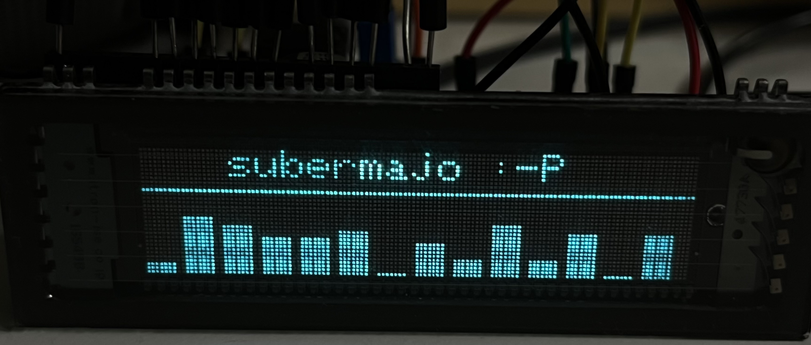

# Status

Works. (On Teensy only !?)

| This was 3 days of brainfuug, feel free motivating me kepp publishing such stuff. | <a href="https://www.buymeacoffee.com/mariosgeu" target="_blank"></a> |
|---|---|

[See my notes and theory docs for more detail on it's inner workings](NOTES.md)



# Usage

### Within PlatformIO

You can either...
* clone this repo into yout lib folder
* same but as submodule ```git submodule add <repo addr> lib/VFD_MN12832L```
* add repo to platformio.ini ```lib_deps = mariosgit/VFD_MN12832L```

Branch "greyscales" has a version with 4 greyscales. This requires more memory and twice the CPU time. 

### Arduino

?? copy the repo into your local libraries folder ??

## Example

see examples folder.

instanciate a display
```
MN12832L display;
```
or with your own pins... (MOSI and SCK must fit one of the hardware SPI pins)
```
MN12832L display(
    /* pinBLK = */ 4,
    /* pinLAT = */ 6,
    /* pinGCP = */ 3,
    /* MOSI_PIN = */ 11,
    /* SCK_PIN = */ 13,
    /* pinPWM = */ 20);
```

Call begin during setup...
```
void setup()
{
    display.begin();
    display.fillScreen(0);
}
```

Draw something and swap buffers...
```
void loop()
{
    display.fillScreen(0);
    display.drawLine(0,0,31,31,1);
    display.swapBuffers();
}
```