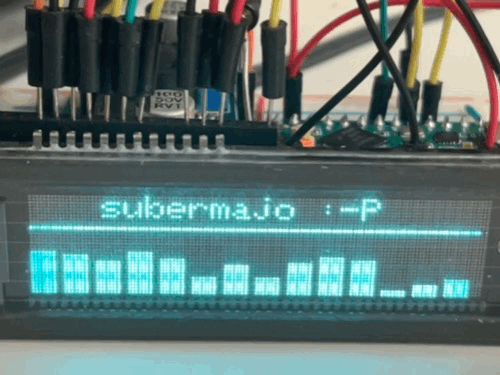

# Status

Works.

| This was 3 days of brainf*:O, feel free to motivate me to publishing such things ! | <a href="https://www.buymeacoffee.com/mariosgeu" target="_blank"></a> |
|---|---|

[See my notes and theory docs for more detail on it's inner workings](README.md)



# Usage

### Within PlatformIO

You can either...
* clone this repo into yout lib folder
* same but as submodule ```git submodule add <repo addr> lib/VFD_MN12832L```
* add repo to platformio.ini ```lib_deps = mariosgit/VFD_MN12832L```

### Arduino

?? copy the repo into your local libraries folder ??

## Example

see examples folder.
