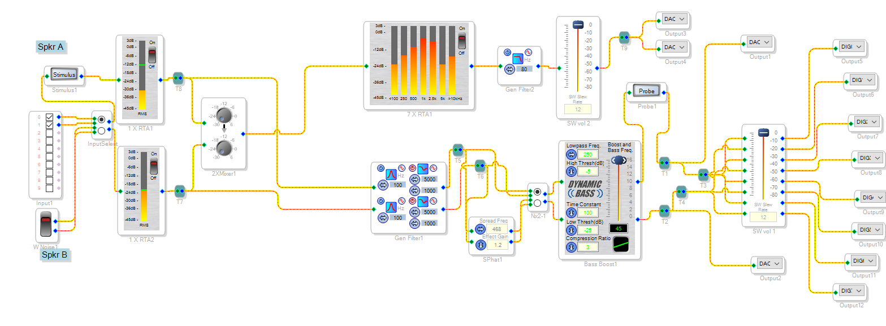

# FreeDSPController Firmware

This is supposed to run on the thing in the PCB-Eagle folder.
Features display, 2 encoders, 2 flip switches. Can communicate with other gear via I2C.

## Status

* tested encoders
  * these move the smiley around.
* added LevelMeter readback from the DataCapture registers of the DSP.
* added Volume Control with the right encoder. It does linear volume setting for now, need to do some math to get a reasonable dB scale.

# Schematic from SigmaStudio

