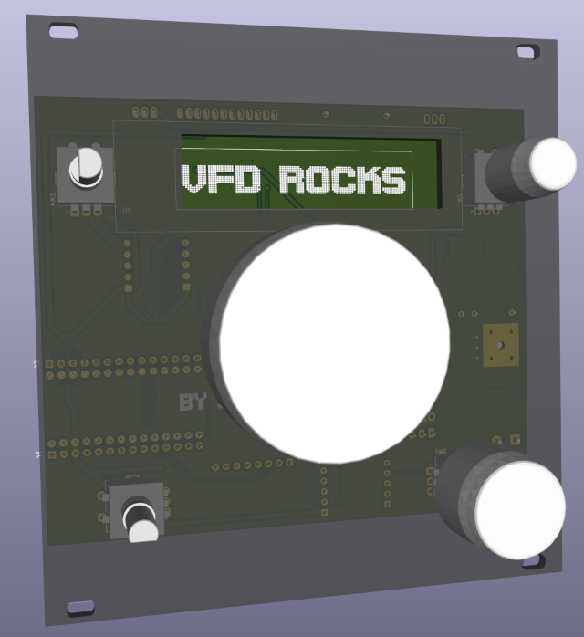

# FreeDSP Controller with MN12832L

| | |
|---|---|
|  |  |
| | |


## Usage

Top left encoder - Select EQ chanel

Top right encoder - turn EQ channel up/down

Center - Volume

Bottom Left - Crunchines

Bottom Right - Volumem press to toggle Mute states.

#### Main page

Center Encoder - Volume up/down
Bottom Right Encoder - Volume up/down, Click toggles mute between Headphone and Speaker.

Not much more implemented so far.

## Bugs

DSP does not boot itself !?. Press reset while panel has not started connecting - 4sec. Maybe put dsp-reset on the panel. Would be better for consistency when the prog is uploaded by the teensy.

XL6009 
* voltage divider values are wrong. Old 2.2k / 91k -> **New: 2k / 39k**
* unstable, add input caps 10-47uF + 100nF, a 100nF over R39k removed 25Hz flicker dropouts !???

HC132 Oszilator Values are wrong. Old 2.7k 4.7n -> **New: 2.7k / 100nF???**

Check Value of R3 **New: 4.7ohm**.

Add Caps 100n, 10u 
* close to Display 

Add mounting holes ? Spacer for DSP board?

Fillet at outlines

Add rev polarity safety diode

Add Fuse, ~100mA

Add backlight (LEDs behing the knobs ?)

Add IR receiver and Ambient Lt sensor.

## Todo

Control more stuff.

        // todo: fix 8th frequency, post level could be sum behind speaker eq to track max level ?!
        //       merge input level as 0 in the mux and remove the 2 inputLevels, frees 60 more instructions


### Peak meter !?

Avoid output cliping/overflows !
https://ez.analog.com/dsp/sigmadsp/w/documents/14313/monitoring-average-and-instantaneous-signal-levels


## Done

### Spectrum Analyser

Using the provided 7 Band or Designer Things uses a lot of DSP prog !

PlanB:

Index selectable filter before the EQ level det. Try to sycle through these to get Spectral readings ?!
```
Saveload Write
Cell Name:  EQFilterIDX
Param Value:  0-8
Bytes:  4
Param Data: 0x00, 	0x00, 	0x00, 	0x02
```
The first filter is flat, the others are 8 bands 100,200,400,800,1600,3200,6400,12800,Hz.

The emChecker loop sets these filters one after another and reads the levelmeter behind. This Results in a Spectrum analyser which seems to kind of work somewhat. Good enouth for the beginning.

## References


[SigmaStudio docs, recipes for filters](https://wiki.analog.com/resources/tools-software/sigmastudio/toolbox/filters/general2ndorder)


#### The strangly vintage universe of SigmaDSP

Dear analog devices, you web resources did'nt age so well.

Documentation of the DSP blocks... best to search with Ggl
https://wiki.analog.com/resources/tools-software/sigmastudio/toolbox/leveldetectorslookuptables/singlebandleveldetector

Reading Levels and other tutorials ... https://ez.analog.com/dsp/sigmadsp/w/documents/14313/monitoring-average-and-instantaneous-signal-levels


### SigmaStudio logs

#### SoftClip

Link [SigmaWiki SoftClip:](https://wiki.analog.com/resources/tools-software/sigmastudio/toolbox/nonlinearprocessors/standardcubic)


```
Block Write
Time:  17:31:17 - 173ms
IC:  IC 1
Cell Name:  SoftClip1
Param Name:  SoftClipAlgG21alpha
Param Address:  0x0062
Param Value:  10
Bytes:  4
Param Data:
0x05, 	0x00, 	0x00, 	0x00
```


Change to "9" which is off. Range is 0.1 - 10. You always write the value and it's reciproke, so 1/9. SigStud does a block write here. Values 3,4 are static.

```
Cell Name:  SoftClip1
Param Name:  SoftClipAlgG21alpha
Param Address:  0x0062
Param Value:  9
Bytes:  4
Param Data: 0x04, 	0x80, 	0x00, 	0x00

Cell Name:  SoftClip1
Param Name:  SoftClipAlgG21alpham1
Param Address:  0x0063
Param Value:  0.111111164093018
Bytes:  4
Param Data:
0x00, 	0x0E, 	0x38, 	0xE4

// constant.. ?

Cell Name:  SoftClip1
Param Name:  SoftClipAlgG21onethird
Param Address:  0x0064
Param Value:  0.333333373069763
Bytes:  4
Param Data: 0x00, 	0x2A, 	0xAA, 	0xAB

Cell Name:  SoftClip1
Param Name:  SoftClipAlgG21twothird
Param Address:  0x0065
Param Value:  0.666666626930237
Bytes:  4
Param Data: 0x00, 	0x55, 	0x55, 	0x55
```

turn to bypass
```
Cell Name:  Nx2-1
Param Name:  StMuxSwSlew1coeffname
Param Address:  0x0097
Param Value:  0
Bytes:  4
Param Data: 0x00, 	0x00, 	0x00, 	0x00
```

turn switch on
```
Cell Name:  Nx2-1
Param Name:  StMuxSwSlew1coeffname
Param Address:  0x0097
Param Value:  1
Bytes:  4
Param Data: 0x00, 	0x00, 	0x00, 	0x01
```

##### Turning the Crossover to 110Hz

It writes B0,B1,A1 only ? Yes, first order lowpass and highpass only change these, the others are 0 or 1... 

ah and the low side is inverted due to phase...

lowpass 110
| bs | as |
|---|---|
|0.007148143726676948 | (1.0) |
|0.007148143726676948 | -0.9857037125466461*-1 |
|0 | 0 |

highpass 110
| bs | as |
|---|---|
| 0.9928518562733231   | (1.0) |
| -0.992851856273323   | -0.9857037125466461*-1 |
| 0                    | 0 |

ok, SP1 are the lowpasses
SP2 the highpasses ??? do not see this !
and the postfix _0 _1 is the channel, puh

Arrrg :-O , in the header it's named clearly as ```MOD_CROSSOVER1_ALG1_LOW_FILT1_PARAMB0_ADDR```

```
Cell Name:  Crossover1
Param Name:  CrossoverFilter2WayAlgSP1B0_0
Param Address:  0x00FA
Param Value:  0.0071481466293335

Cell Name:  Crossover1
Param Name:  CrossoverFilter2WayAlgSP1B1_0
Param Address:  0x00FB
Param Value:  0.0071481466293335

Cell Name:  Crossover1
Param Name:  CrossoverFilter2WayAlgSP1A1_0
Param Address:  0x00FC
Param Value:  0.985703706741333

Cell Name:  Crossover1
Param Name:  CrossoverFilter2WayAlgSP1B0_1
Param Address:  0x00FD
Param Value:  0.0071481466293335

Cell Name:  Crossover1
Param Name:  CrossoverFilter2WayAlgSP1B1_1
Param Address:  0x00FE
Param Value:  0.0071481466293335

Cell Name:  Crossover1
Param Name:  CrossoverFilter2WayAlgSP1A1_1
Param Address:  0x00FF
Param Value:  0.985703706741333

------SP2

Cell Name:  Crossover1
Param Name:  CrossoverFilter2WayAlgSP2B0_0
Param Address:  0x0107
Param Value:  0.0071481466293335

Cell Name:  Crossover1
Param Name:  CrossoverFilter2WayAlgSP2B1_0
Param Address:  0x0108
Param Value:  0.0071481466293335

Cell Name:  Crossover1
Param Name:  CrossoverFilter2WayAlgSP2A1_0
Param Address:  0x0109
Param Value:  0.985703706741333

Cell Name:  Crossover1
Param Name:  CrossoverFilter2WayAlgSP2B0_1
Param Address:  0x010A
Param Value:  0.0071481466293335

Cell Name:  Crossover1
Param Name:  CrossoverFilter2WayAlgSP2B1_1
Param Address:  0x010B
Param Value:  0.0071481466293335

Cell Name:  Crossover1
Param Name:  CrossoverFilter2WayAlgSP2A1_1
Param Address:  0x010C
Param Value:  0.985703706741333
```

invert an/aus, mhm ok it's another param, does not effect the biquads
```
// on
Param Name:  CrossoverFilter2WayAlgSP1LowInvert
Param Address:  0x00F9
Param Value:  -1

Param Name:  CrossoverFilter2WayAlgSP2LowInvert
Param Address:  0x0106
Param Value:  -1

//off
Param Name:  CrossoverFilter2WayAlgSP1LowInvert
Param Address:  0x00F9
Param Value:  1

Param Name:  CrossoverFilter2WayAlgSP2LowInvert
Param Address:  0x0106
Param Value:  1
```


##### InputMixer

turn up chanel 0/1

```
Safeload Write
Time:  23:09:22 - 120ms
IC:  IC 1
Cell Name:  NxM Mixer1
Param Name:  NxNMixer1940Alg1_01_01
Param Address:  0x0017
Param Value:  1.99526226520538
Bytes:  4
Param Data:
0x00, 	0xFF, 	0x64, 	0xC1

Safeload Write
Time:  23:09:39 - 664ms
IC:  IC 1
Cell Name:  NxM Mixer1
Param Name:  NxNMixer1940Alg1_00_00
Param Address:  0x0011
Param Value:  1.99526226520538
Bytes:  4
Param Data:
0x00, 	0xFF, 	0x64, 	0xC1
```

##### Switching Sinus on off

Second value is freq ? 65Hz

off 

```
Safeload Write
Cell Name:  Tone1
Param Name:  sin_lookupAlg19401mask
Param Address:  0x0003
Param Value:  255
Bytes:  4
Param Data: 0x00, 	0x00, 	0x00, 	0xFF

Safeload Write
Cell Name:  Tone1
Param Name:  sin_lookupAlg19401increment
Param Address:  0x0004
Param Value:  0.0027087926864624
Bytes:  4
Param Data:0x00, 	0x00, 	0x58, 	0xC3

Safeload Write
Cell Name:  Tone1
Param Name:  sin_lookupAlg19401ison
Param Address:  0x0005
Param Value:  0
Bytes:  4
Param Data: 0x00, 	0x00, 	0x00, 	0x00
```

on

```
Safeload Write
Cell Name:  Tone1
Param Name:  sin_lookupAlg19401mask
Param Address:  0x0003
Param Value:  255
Bytes:  4
Param Data: 0x00, 	0x00, 	0x00, 	0xFF

Safeload Write
Cell Name:  Tone1
Param Name:  sin_lookupAlg19401increment
Param Address:  0x0004
Param Value:  0.0027087926864624
Bytes:  4
Param Data: 0x00, 	0x00, 	0x58, 	0xC3

Safeload Write
Cell Name:  Tone1
Param Name:  sin_lookupAlg19401ison
Param Address:  0x0005
Param Value:  1
Bytes:  4 Param Data: 0x00, 	0x80, 	0x00, 	0x00
```

freq 80Hz

```
Safeload Write
Cell Name:  Tone1
Param Name:  sin_lookupAlg19401mask
Param Address:  0x0003
Param Value:  255
Bytes:  4
Param Data:
0x00, 	0x00, 	0x00, 	0xFF

Safeload Write
Cell Name:  Tone1
Param Name:  sin_lookupAlg19401increment
Param Address:  0x0004
Param Value:  0.00333333015441895
Bytes:  4
Param Data: 0x00, 	0x00, 	0x6D, 	0x3A

Safeload Write
Cell Name:  Tone1
Param Name:  sin_lookupAlg19401ison
Param Address:  0x0005
Param Value:  0
Bytes:  4
Param Data: 0x00, 	0x00, 	0x00, 	0x00
```

##### Peak and Avg Readback

```
Read Init
Cell Name:  ReadBackUserEQ
Param Name:  ReadBackAlg1
Param Address:  0x081A
Bytes:  2
Param Data:   0x05, 	0xB2

Read Request
Cell Name:  ReadBackUserEQ
Param Name:  ReadBackAlg1
Param Address:  0x081A
Bytes:  3

Read Result
Cell Name:  ReadBackUserEQ
Param Name:  ReadBackAlg1
Param Address:  0x081A
Bytes:  1
Param Data:   0x10, 	0x52, 	0x1D
```


### Comparing Biquad calculators...

SigmaStudio Bandpass produces this 100Hz BW:2

* b0 = 0.00972211360931396
* b1 = 0
* b2 = -0.00972211360931396
* a1 = 1.98038613796234
* a2 = -0.980555891990662

**exactly what teensy audio biquad.h produces :)**

[earlevel eng..](https://www.earlevel.com/main/2021/09/02/biquad-calculator-v3/) 
a und b are swaped, use a results as b ```bi[0,1,2]``` , use b results **inverted** as a ```bi[3,4]```